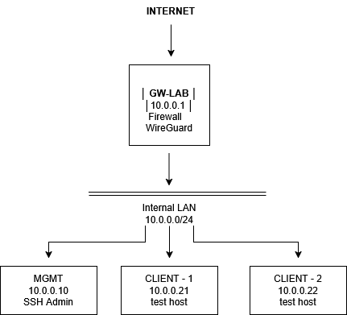

# Project 58–59
Retro Cybersecurity Infrastructure Lab

## What this lab is

Project 58–59 is a hands-on cybersecurity infrastructure lab inspired by early 2000s security concepts discussed,reimplemented using modern Linux tooling.

The lab recreates a small internal network and gradually hardens it using contemporary security practices.

The goal is to connect historical hacking concepts with modern infrastructure engineering.

---

## Project Goal

Build a small but realistic network environment and progressively improve its security.

The lab demonstrates practical understanding of:

- Linux networking
- secure remote administration
- VPN architecture
- firewall design
- system visibility and logging

Instead of isolated exercises, the project evolves one infrastructure step by step.

---

## Network Topology :

---

## Lab Progress

| Level   | Name                          | Status        |
| ------- | ----------------------------- | ------------- |
| Level 1 | Infrastructure Base           | ✔ Completed   |
| Level 2 | Secure Overlay (WireGuard)    | ✔ Completed   |
| Level 3 | Firewall Control (iptables)   | ✔ Completed   |
| Level 4 | Recon & Visibility            | ⚙ In Progress |
| Level 5 | SMB Enumeration               | ⏳ Planned     |
| Level 6 | Beacon Simulation             | ⏳ Planned     |
| Level 7 | Centralized Control (Ansible) | ⏳ Planned     |
| Level 8 | Storage & Recovery            | ⏳ Planned     |
| Level 9 | Memory Fundamentals           | ⏳ Planned     |

The lab progresses step-by-step from basic infrastructure setup to security monitoring, offensive reconnaissance, centralized control and memory exploitation fundamentals.

---

## Lab Machines

| Host     | Role                                                | IP        |
| -------- | --------------------------------------------------- | --------- |
| GW-LAB   | Gateway, Firewall, WireGuard server                 | 10.0.0.1  |
| MGMT     | Administration host (SSH management)                | 10.0.0.10 |
| CLIENT-1 | Test host for reconnaissance and segmentation tests | 10.0.0.21 |
| CLIENT-2 | Test host for lateral movement simulations          | 10.0.0.22 |

---

## What this project demonstrates

This lab shows practical skills in:

- building controlled Linux infrastructure
- implementing secure remote access
- deploying modern VPN technology
- designing firewall policies
- observing system behavior through logs

The project focuses on real operational practices rather than theoretical exercises.

---

## Next Stage

LEVEL 4 — Reconnaissance & Visibility

The next stage will introduce network scanning and analysis.

Using Nmap from an internal client, the lab will demonstrate:

- how services appear during reconnaissance
- how firewall rules affect scan results
- how scanning activity is visible in system logs

This step connects defensive infrastructure with attacker reconnaissance techniques.
