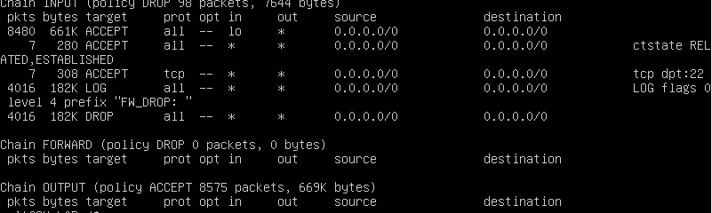
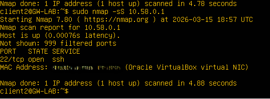
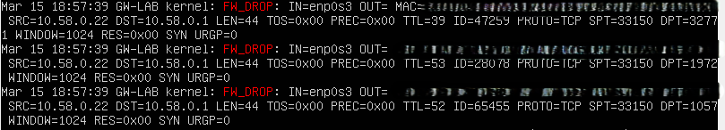

# Level 4 — Reconnaissance and Visibility

This level demonstrates how network reconnaissance interacts with a firewall and how scanning activity becomes visible through system logging.

The concept is inspired by early reconnaissance techniques widely discussed in early 2000s cybersecurity culture (for example in *Хакер* magazine), but implemented using modern Linux tools.

The objective is to observe how **Nmap scanning triggers firewall events** and how those events appear in **kernel logs**.

---

## Lab Environment

**Network**

LAB5859
10.58.0.0/24

**Machines used in this stage**

| Machine  | IP         | Role                |
| -------- | ---------- | ------------------- |
| GW-LAB   | 10.58.0.1  | Gateway / firewall  |
| CLIENT-2 | 10.58.0.22 | Reconnaissance node |

---

## Firewall Configuration

The gateway uses a **deny-by-default firewall model**.

**Default policies**

```id="k8rj6p"
INPUT DROP
FORWARD DROP
OUTPUT ACCEPT
```
**Troubleshooting:**
iptables commands produced "temporary failure in name resolution"

Cause:
missing /etc/hosts entry for system hostname

Fix:
added hostname to /etc/hosts

**Allowed traffic**

* loopback
* ESTABLISHED,RELATED connections
* SSH from MGMT (10.58.0.10)
* WireGuard UDP 51820
* HTTP port 8000 (lab service)

All other traffic is logged and dropped.


---

## Monitoring Firewall Logs

Firewall logs are generated by the **Linux kernel**.

To observe firewall events in real time:

```bash id="t7u4b3"
sudo journalctl -k -f
```

Options:

| Option | Description              |
| ------ | ------------------------ |
| -k     | show kernel messages     |
| -f     | follow logs in real time |

This command allows observation of how reconnaissance traffic interacts with the firewall.

---

## Reconnaissance Using Nmap

Scanning was performed from **CLIENT-2**.

**Target**

```id="e6l1hv"
10.58.0.1 (GW-LAB)
```

---

### Basic Scan

```bash id="xt0h3y"
nmap 10.58.0.1
```

Purpose:

Discover exposed services through the firewall.

Example output:



Interpretation:

| State    | Meaning                    |
| -------- | -------------------------- |
| open     | service is reachable       |
| filtered | firewall blocked the probe |

The firewall hides closed ports by dropping packets instead of rejecting them.

---

### Aggressive Scan

```bash id="b6qqd2"
nmap -A 10.58.0.1
```

This scan performs:

* service detection
* OS detection
* traceroute
* script scanning

During this scan, firewall logs show repeated connection attempts.

---

### Full Port Scan

```bash id="4k6d2n"
nmap -p- 10.58.0.1
```

This scans all **65535 TCP ports**.

Result:

A large number of blocked connection attempts are recorded in firewall logs.

---

## Firewall Log Visibility

While scans are running, firewall events appear in the system journal.

Example log entry:



Field meanings:

| Field | Description                    |
| ----- | ------------------------------ |
| SRC   | source host (scanner)          |
| DST   | destination host               |
| SPT   | source port                    |
| DPT   | destination port being scanned |

These logs allow defenders to identify reconnaissance activity.

---

## Security Concepts Demonstrated

This level illustrates several important security principles.

### Reconnaissance Detection

Network scanning generates detectable patterns in firewall logs.

### Firewall Stealth Behavior

Using **DROP** instead of **REJECT** prevents attackers from learning which ports are closed.

### Defensive Visibility

Kernel logs allow defenders to detect scanning activity in real time.

---

## Result of Level 4

After completing this stage, the lab environment provides:

```id="t4xv39"
isolated internal network
centralized management node
encrypted WireGuard overlay
deny-by-default firewall
kernel-level firewall logging
reconnaissance visibility through Nmap scanning
```

This stage connects **offensive reconnaissance techniques** with **defensive monitoring**.
